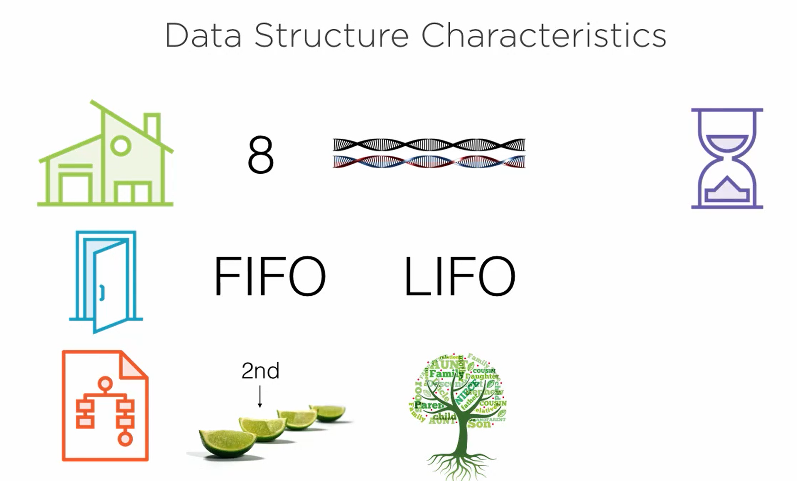
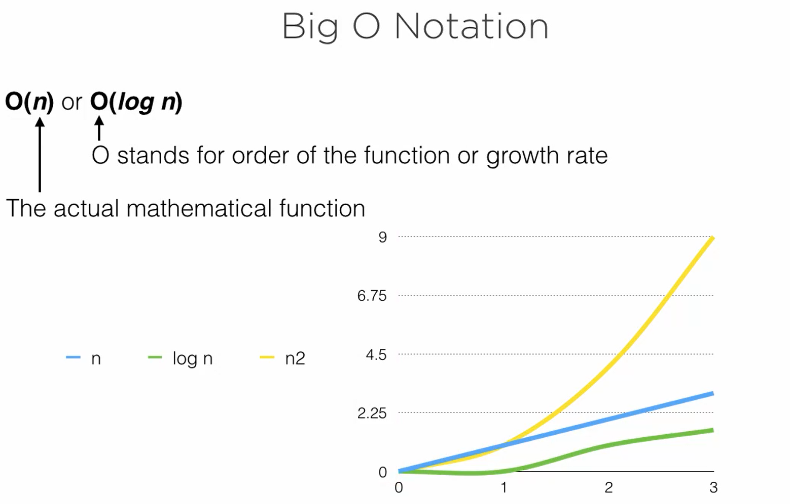
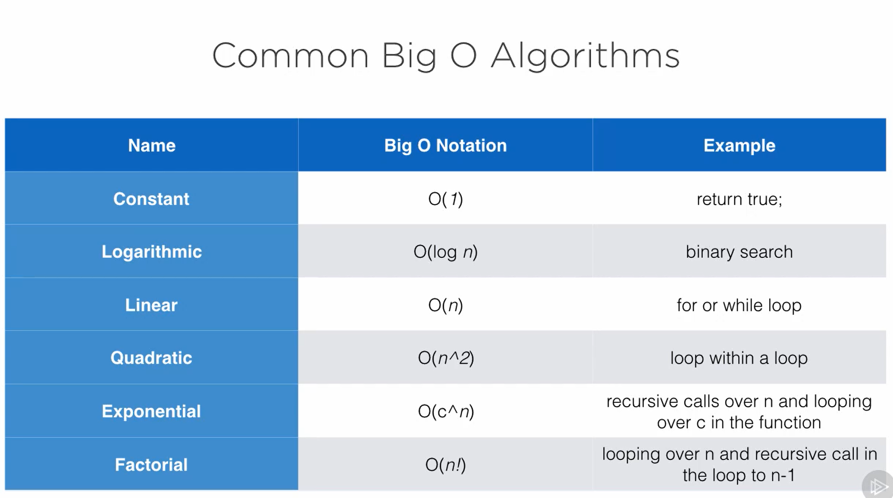
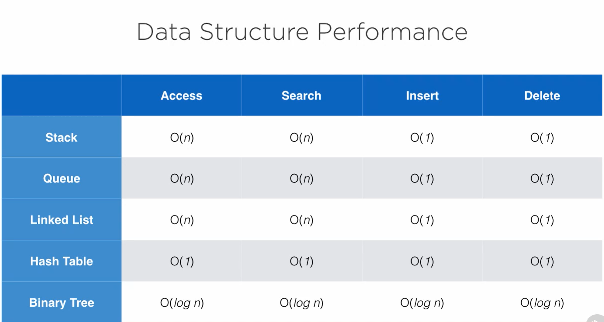
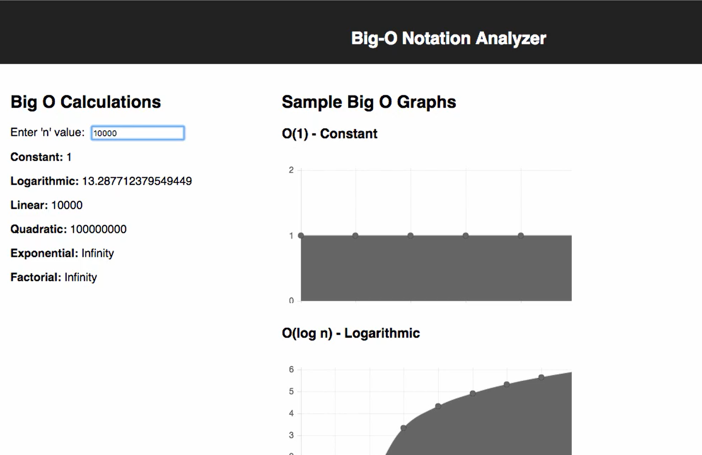

# Data Structures Study

## Implementing and Understanding Data Structures in Java

## Data Structure Line Up

- Stack
- Queue
- Linked List
- Hash Table
- Binary Tree

## Data Structure

A method of organizing information so that the information can be stored and retrieved efficiently.

Data Structure Characteristics

Note: In fact, performance is one of the main deciding factors when choosing a data structure for your needs

Computer science defines performance by something called **Big O notation.**

O(n) or O(log n)

- We can visualize the performance issues in each big O notation using the app > https://github.com/dlbunker/big-o-performance
