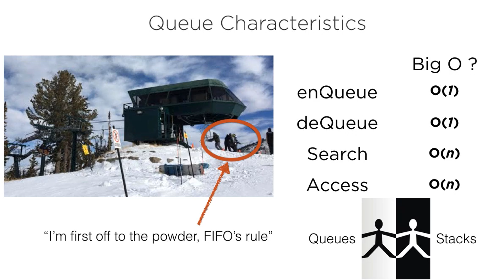
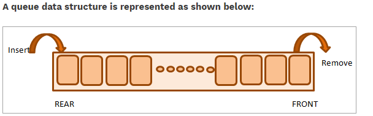
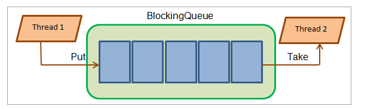

# Queue

## What is a Queue?

"A queue is an ordered line or sequence"

Queues and stacks really go hand in hand and are very similar overall, the only difference between the two is how data is added or removed from the structure.

A queue is a FIFO (first in, first out) whereas stacks are LIFO (last in, first out).

As shown in the above diagram, a queue is a structure having two points i.e. start (front) and end (rear). Elements are inserted into the queue at the rear end and removed from the queue at the front.

### **BlockingQueue In Java**

BlockingQueue is an Interface added in Java 1.5 and is a part of the **java.util.concurrent** package. This interface introduces blocking in case the BlockingQueue is full or empty.

Thus when a thread accesses the queue and tries to insert (enqueue) elements in a queue that is already full is blocked till another thread creates a space in the queue (maybe by dequeue operation or clearing queue).

Similarly, in the case of dequeuing, the operation is blocked if the queue is empty until the element becomes available for the dequeue operation.

The BlockingQueue methods use some form of concurrency control like internal locks and are atomic. The BlockingQueue is a concurrent queue that manages the queue operations concurrently.

**The BlockingQueue is shown below:**

Note that BlockingQueue does not accept null values. An attempt to insert a null value in the queue results in NullPointerException.

Some of the BlockingQueue implementations provided in Java are LinkedBlockingQueue, PriorityBlockingQueue, ArrayBlockingQueue, and SynchonousQueue. All these implementations are thread-safe.

### **BlockingQueue Types**

**BlockingQueues are of two types:**

### **Bounded Queue**

In the bounded queue, the capacity of the queue is passed to the constructor of the queue.

**The queue declaration is as follows:**

`BlockingQueue blockingQueue = new LinkedBlockingDeque (5);`

### **Unbounded Queue**

In the unbounded queue, we don’t set the capacity of the queue explicitly and it can grow in size. The capacity is set to Integer.MAX_VALUE.

**The declaration of the unbounded queue is as follows:**

`BlockingQueue blockingQueue = new LinkedBlockingDeque ();`

The BlockingQueue interface is primarily used for producer-consumer types of problems wherein producer produces the resources and consumer consumes the resources.