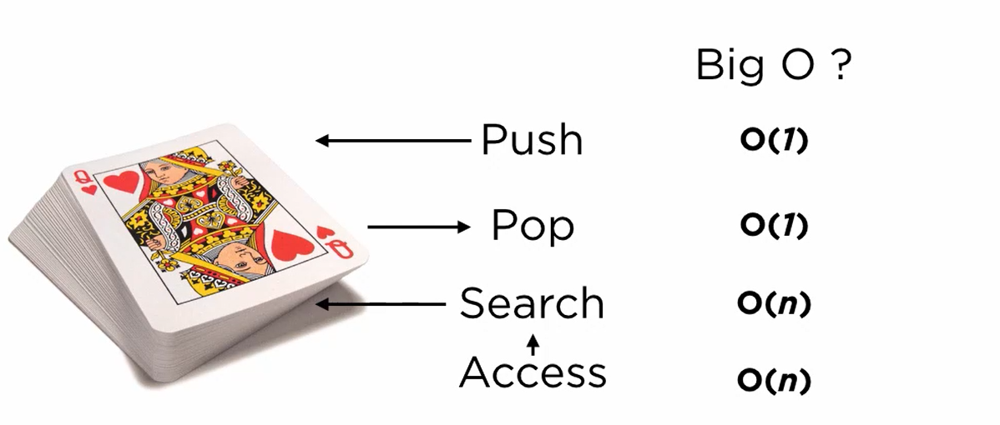
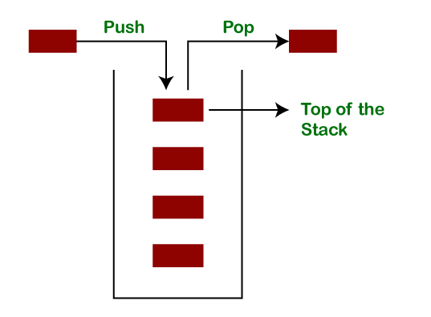
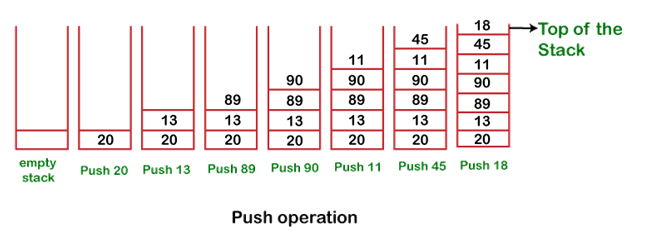
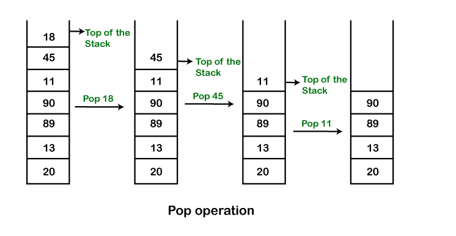

# Stack

## What is a Stack?

# Java Stack

The **stack** is a linear data structure that is used to store the collection of objects. It is based on **Last-In-First-Out** (LIFO). [Java collection](https://www.javatpoint.com/collections-in-java) framework provides many interfaces and classes to store the collection of objects. One of them is the **Stack class** that provides different operations such as push, pop, search, etc.

The stack data structure has the two most important operations that are **push** and **pop**. The push operation inserts an element into the stack and pop operation removes an element from the top of the stack. Let's see how they work on stack.

Images from:

[https://www.javatpoint.com/java-stack](https://www.javatpoint.com/java-stack)

Let's push 20, 13, 89, 90, 11, 45, 18, respectively into the stack.

### Core Java Stacks

Stack and Deque